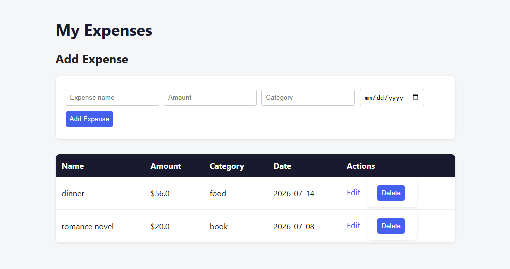

# 💰 Expense Tracker

A full-stack web application for tracking personal expenses, built with Flask and SQLite. Users can add, view, edit, and delete expense entries through a clean, responsive interface.



## 🔗 Live Demo

[View live app](#) (https://expense-tracker-my0s.onrender.com)

## ✨ Features

- **Add expenses** — record name, amount, category, and date
- **View all expenses** — sorted by most recent
- **Edit expenses** — update any entry after it's been added
- **Delete expenses** — remove entries no longer needed
- Clean, responsive UI with custom styling

## 🛠️ Built With

- **Backend:** Python, Flask
- **Database:** SQLite
- **Frontend:** HTML, CSS, Jinja2 templating

## 🚀 Getting Started

### Prerequisites
- Python 3.8+

### Installation

1. Clone the repository
   ```bash
   git clone https://github.com/mehrnuslh/expense-tracker.git
   cd expense-tracker
   ```

2. Create and activate a virtual environment
   ```bash
   python -m venv venv
   # Windows:
   venv\Scripts\Activate.ps1
   # Mac/Linux:
   source venv/bin/activate
   ```

3. Install dependencies
   ```bash
   pip install -r requirements.txt
   ```

4. Initialize the database
   ```bash
   python database.py
   ```

5. Run the app
   ```bash
   python app.py
   ```

6. Open your browser to `http://127.0.0.1:5000`

## 📁 Project Structure

```
expense-tracker/
├── app.py              # Flask application and routes
├── database.py         # Database initialization
├── requirements.txt    # Python dependencies
├── static/
│   └── style.css       # Styling
└── templates/
    ├── index.html       # Main page (list + add form)
    └── edit.html         # Edit expense page
```

## 🔮 Future Improvements

- User authentication (per-user expense tracking)
- Monthly spending totals and category breakdowns
- Data visualization with charts
- Filter/search expenses by date or category
- Export to CSV

## 👤 Author

**Mehrnoosh Deljoo**
[GitHub](https://github.com/mehrnuslh)